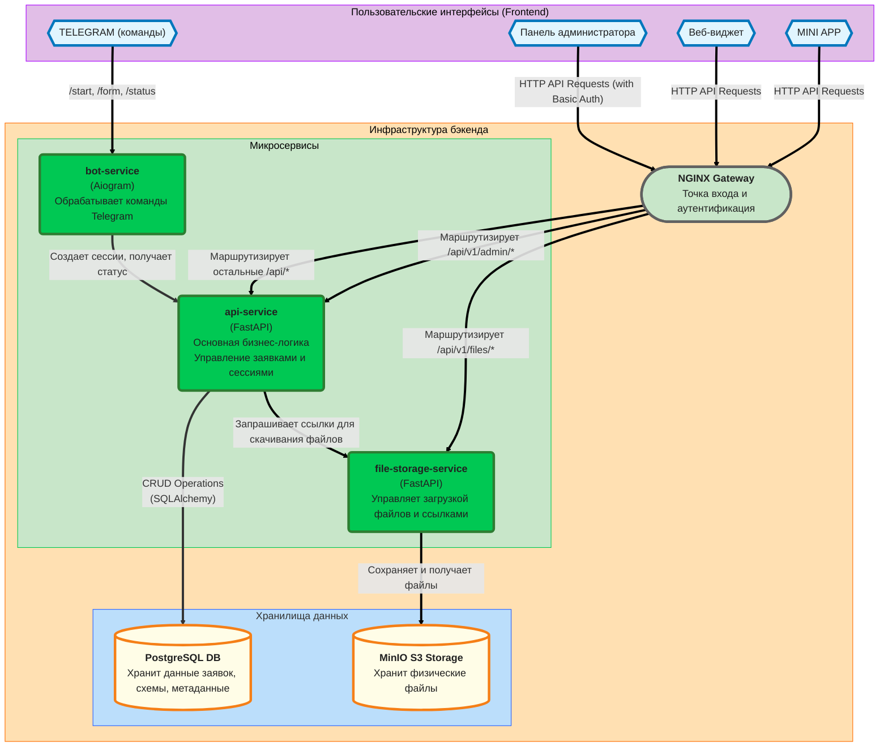

# Бэкенд для MVP Благотворительного Фонда «Продвижение»

Этот проект представляет собой бэкенд-систему, реализованную на микросервисной архитектуре, для автоматизации сбора заявок от подопечных через виджет на сайте и чат-бота в Telegram.

## Оглавление

- [Технологический стек](#технологический-стек)
- [Требования](#требования)
- [Документация API (Swagger/ReDoc)](#документация-api-swagger-redoc)
- [Быстрый старт](#быстрый-старт)
- [Доступ к сервисам](#доступ-к-сервисам)
- [Команды Telegram-бота](#команды-telegram-бота)
- [Разработка](#разработка)
  - [Pre-commit хуки](#pre-commit-хуки)
  - [Тестирование](#тестирование)
- [Конфигурация (.env)](#конфигурация-env)
- [Структура проекта](#структура-проекта)
- [Процесс загрузки файлов](#процесс-загрузки-файлов)

## Технологический стек

*   **Язык:** Python 3.12
*   **Фреймворки:** FastAPI (для API), Aiogram 3 (для Telegram-бота)
*   **База данных:** PostgreSQL
*   **Хранилище файлов:** MinIO (S3-совместимое)
*   **Оркестрация:** Docker, Docker Compose
*   **Веб-сервер/API Gateway:** Nginx
*   **Инструменты разработки:** Ruff, Pyright, Pre-commit, UV
*   **Тестирование и визуализация:** Postman, DBeaver, Pytest

## Документация API (Swagger/ReDoc)

*   **Динамическая документация `api-service`:**
    *   Swagger UI: `http://localhost:8000/docs`
    *   ReDoc: `http://localhost:8000/redoc`

*   **Динамическая документация `file-storage-service`:**
    *   Swagger UI: `http://localhost:8002/docs`
    *   ReDoc: `http://localhost:8002/redoc`
    *   *Примечание: Этот порт открыт для удобства разработки.*

## Требования

Для запуска и работы с проектом вам понадобятся:

*   **Docker**
*   **Docker Compose**
*   **Git**

Для локальной разработки также рекомендуется установить:
*   [uv](https://github.com/astral-sh/uv) (быстрый менеджер пакетов Python)
*   [pre-commit](https://pre-commit.com/) (для запуска проверок перед коммитом)

## Быстрый старт

1.  **Клонируйте репозиторий:**
    ```bash
    git clone https://github.com/ProDvizhenieChatBot/dvizhenie-microservices-backend.git
    cd dvizhenie-microservices-backend
    ```

2.  **Создайте файл конфигурации:**
    Скопируйте файл с примером переменных окружения.
    ```bash
    cp .env.example .env
    ```

3.  **Заполните `.env` файл:**
    Откройте файл `.env` в текстовом редакторе и обязательно заполните следующие переменные:
    *   `TELEGRAM_BOT_TOKEN`: Укажите токен вашего Telegram-бота.
    *   `MINI_APP_URL`: Укажите URL, на котором будет размещено ваше веб-приложение (Mini App).

4.  **Соберите и запустите контейнеры:**
    Эта команда скачает образы, соберет ваши сервисы и запустит их в фоновом режиме. Для применения изменений в Nginx, пересоберите его образ.
    ```bash
    docker-compose up -d --build
    ```

После выполнения этих шагов вся система будет запущена и готова к работе.

## Доступ к сервисам

После успешного запуска сервисы будут доступны по следующим адресам:

*   **API Gateway (Nginx):** `http://localhost:8000`
    *   Все запросы к API (`/api/...`) проходят через этот шлюз.
*   **MinIO Console (веб-интерфейс для файлов):** `http://localhost:9001`
    *   **Логин:** `minioadmin` (или значение `MINIO_ROOT_USER` из `.env`)
    *   **Пароль:** `minioadmin` (или значение `MINIO_ROOT_PASSWORD` из `.env`)
*   **Telegram Бот:**
    *   Найдите вашего бота в Telegram и отправьте ему команду `/start`.

### Команды Telegram-бота

Для взаимодействия с ботом в Telegram доступны следующие команды:

*   `/start` — приветственная команда. Бот предоставляет информацию о своих возможностях и перечисляет доступные команды для взаимодействия.

*   `/form` — основная команда для подачи заявки. Бот создает (или возобновляет, если у вас есть незавершенный черновик) сессию заявки через `api-service` и присылает кнопку для открытия веб-приложения (Mini App) с анкетой.

*   `/status` — позволяет пользователю узнать текущий статус своей последней поданной заявки. Бот запрашивает информацию у `api-service` и отправляет пользователю понятное сообщение (например, "Ваша заявка на рассмотрении").

### Руководство по редактированию анкеты

Для администраторов и менеджеров фонда доступно руководство, объясняющее, как устроена и как редактировать JSON-схему анкеты.
Это позволяет изменять вопросы, варианты ответов и логику анкеты без необходимости привлекать разработчиков.

## Разработка

### Pre-commit хуки

В проекте настроены pre-commit хуки для автоматической проверки и форматирования кода перед каждым коммитом. Это обеспечивает единый стиль кода и помогает избежать простых ошибок.

1.  **Установка (один раз для проекта):**
    После установки `pre-commit` глобально, выполните в корне проекта:
    ```bash
    pre-commit install
    ```

2.  **Использование:**
    Теперь, при каждой попытке `git commit`, будут автоматически запускаться `ruff` (форматирование и линтинг) и `pyright` (проверка типов). Если хуки найдут ошибки, коммит будет прерван. Исправьте ошибки и повторите коммит.

3.  **Ручной запуск:**
    Вы можете запустить все проверки для всех файлов в любой момент:
    ```bash
    pre-commit run --all-files
    ```

### Тестирование

### Автоматическое тестирование

Проект включает наборы автоматических тестов для всех сервисов (`api-service`, `bot-service`, `file-storage-service`) с использованием `pytest` для обеспечения стабильности и предотвращения регрессий.

#### Запуск тестов

В проекте предусмотрено два основных способа запуска автоматических тестов: для всей системы сразу или для каждого сервиса по отдельности.

##### Запуск всех тестов одновременно (Рекомендуется для CI/CD)

Для комплексной проверки всей системы и всех микросервисов в корне проекта предусмотрен специальный скрипт `run_tests.sh`. Он последовательно заходит в директорию каждого сервиса и выполняет его набор тестов.

1.  Убедитесь, что вы находитесь в **корневой директории** проекта.
2.  Выполните команду:
    ```bash
    ./run_tests.sh
    ```
Этот способ идеально подходит для автоматизированных сборок (CI/CD) или для финальной проверки перед отправкой изменений в репозиторий.

##### Запуск тестов для конкретного сервиса

Во время активной разработки или отладки часто бывает удобнее и быстрее запускать тесты только для того сервиса, над которым вы сейчас работаете.

1.  **Перейдите в директорию нужного сервиса.** Например, для `api-service`:
    ```bash
    cd services/api_service
    ```

2.  **Запустите тесты одной командой:**
    ```bash
    uv run --with ".[dev]" pytest
    ```
Эта команда является самодостаточной: `uv` автоматически создаст временное окружение, установит в него основные и `dev`-зависимости (`--with ".[dev]"`) и запустит `pytest`. Это гарантирует, что тесты всегда выполняются в чистом и правильном окружении.

#### Категории тестов

##### `api-service`

*   **Тесты репозитория (`test_repositories.py`)**: Тестирование слоя доступа к данным в изоляции (CRUD-операции, фильтрация, обработка транзакций).
*   **Тесты сервисов (`test_services.py`)**: Тестирование сервисов бизнес-логики (генерация XLSX, создание ZIP-архива) с использованием моков для внешних зависимостей.
*   **Тесты эндпоинтов API (`test_api_endpoints.py`)**: Интеграционные тесты для HTTP-эндпоинтов (валидация запросов/ответов, статус-коды, обработка ошибок).

##### `bot-service`

*   **Тесты API клиента (`test_api_client.py`)**: Проверяют корректность формирования запросов к `api-service` и обработку ответов (успешных и ошибочных).
*   **Тесты обработчиков команд (`test_handlers.py`)**: Изолированно тестируют логику команд бота (`/start`, `/form`, `/status`), проверяя, что пользователю отправляются правильные сообщения и кнопки.

##### `file-storage-service`

*   **Тесты эндпоинтов API (`test_file_endpoints.py`)**: Интеграционные тесты, проверяющие эндпоинты загрузки файла и получения ссылки на скачивание. Взаимодействие с S3 эмулируется с помощью библиотеки `moto`.
*   **Тесты S3 клиента (`test_s3_client.py`)**: Юнит-тесты, проверяющие логику работы с S3, такую как создание бакета.


## Конфигурация (.env)

Основные переменные, которые можно настроить в файле `.env`:

*   `POSTGRES_*`: Настройки для подключения к базе данных PostgreSQL.
*   `TELEGRAM_BOT_TOKEN`: Секретный токен для вашего Telegram-бота.
*   `MINI_APP_URL`: URL для кнопки Mini App, которую бот отправляет пользователю.
*   `API_SERVICE_URL`: Внутренний адрес API-сервиса, используемый ботом.
*   `MINIO_*`: Учетные данные и название бакета для S3-хранилища MinIO.

## Структура проекта

*   `services/`: Основная директория, содержащая код каждого микросервиса.
    *   **`api_service` (Центральный сервис):** Ядро системы, отвечающее за всю бизнес-логику. Реализован на FastAPI с применением **слоистой архитектуры (Layered Architecture)** для четкого разделения ответственности:
        *   **Слой API (`app/api`)**: Отвечает только за обработку HTTP-запросов, валидацию данных и формирование ответов. Не содержит бизнес-логики и прямых запросов к БД.
        *   **Слой Репозиториев (`app/repositories`)**: Абстракция над базой данных. Инкапсулирует всю логику работы с SQLAlchemy, предоставляя чистый API для CRUD-операций (например, `get_by_uuid`, `create_application`).
        *   **Слой Сервисов (`app/services`)**: Оркестрирует сложные бизнес-операции, используя репозитории (например, генерация XLSX-отчета или ZIP-архива с документами).
    *   **`bot_service` (Telegram-бот):** Сервис на Aiogram 3, который служит интерфейсом между пользователем в Telegram и основной системой. Он преобразует команды бота в API-запросы к `api-service`.
    *   **`file_storage_service` (Файловое хранилище):** Изолированный сервис для работы с файлами. Он принимает файлы от клиента, сохраняет их в S3-совместимое хранилище (MinIO) и генерирует временные безопасные ссылки для их скачивания.
*   `nginx/`: Конфигурация Nginx, который выступает в роли **API Gateway**. Он маршрутизирует все входящие запросы к соответствующим сервисам и обеспечивает базовую аутентификацию для административных эндпоинтов.
*   `docker-compose.yml`: Файл для оркестрации и запуска всех сервисов проекта.
*   `.env.example`: Шаблон с необходимыми переменными окружения.

*   `.pre-commit-config.yaml`: Конфигурация для pre-commit хуков, обеспечивающих качество и единый стиль кода.




## Процесс загрузки файлов(воркфлоу)

Загрузка файла и его привязка к заявке происходит в два этапа, так как за эти операции отвечают разные микросервисы.

**Шаг 1: Загрузка файла в `file-storage-service`**

Клиент (Mini App) отправляет файл напрямую в сервис хранения файлов.

*   **Запрос:** `POST http://localhost:8000/api/v1/files/upload`
*   **Тело:** `multipart/form-data` с полем `file`.
*   **Ответ (`201 Created`):** Сервис сохраняет файл в MinIO и возвращает его уникальный ID.
    ```json
    {
      "file_id": "a1b2c3d4-e5f6-7890-a1b2-c3d4e5f67890.pdf",
      "filename": "passport_scan.pdf",
      "content_type": "application/pdf"
    }
    ```

**Шаг 2: Привязка файла к заявке в `api-service`**

Получив `file_id`, клиент отправляет его в основной API-сервис, чтобы создать связь между файлом и конкретной заявкой.

*   **Запрос:** `POST http://localhost:8000/api/v1/applications/{application_uuid}/files`
*   **Тело (`application/json`):**
    ```json
    {
      "file_id": "a1b2c3d4-e5f6-7890-a1b2-c3d4e5f67890.pdf",
      "original_filename": "passport_scan.pdf",
      "form_field_id": "beneficiary_passport_scan"
    }
    ```
*   **Ответ (`201 Created`):** Сервис создает запись в базе данных, связывая `application_uuid` с `file_id`.